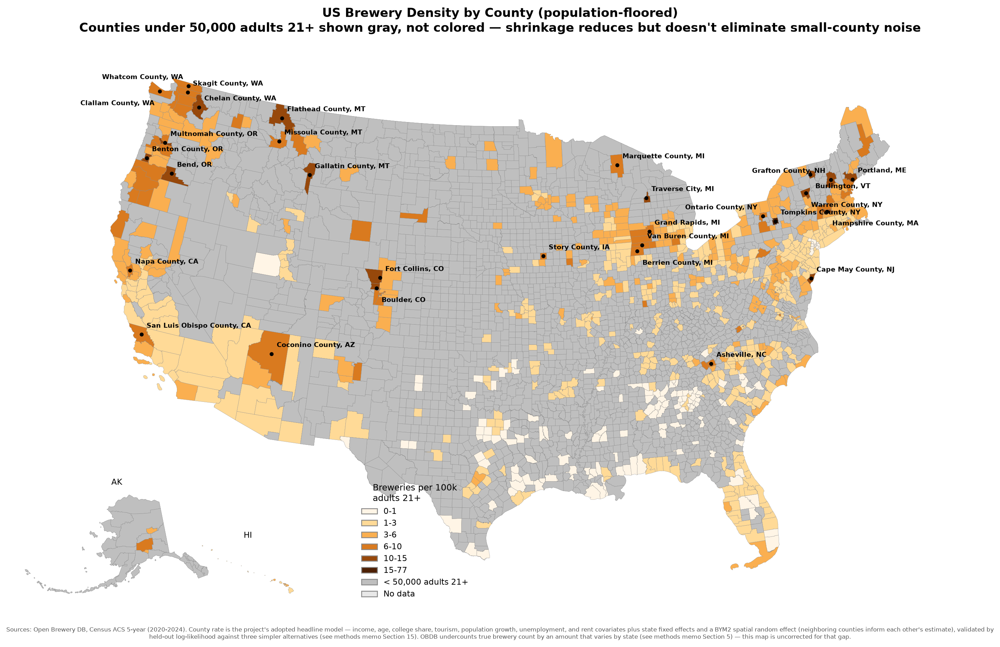

# Brewery Density Analysis

Ranks US geographies by brewery density and models which places have more
breweries than expected after conditioning on tourism, age structure, income,
college enrollment, and state regulatory regime.

**Interactive map:** https://claude.ai/code/artifact/27565f11-c949-4698-8310-4194090118e7
(county/CBSA toggle, defaults to the adopted covariate + spatial "Model rate"
with the plain shrunken/raw/floored rates available as toggleable
alternatives, zoom and pan, hover for exact numbers, and a
calibration-confidence overlay — hatched counties/CBSAs sit in states
without a directly-measured OBDB capture rate, so their coverage estimate
is a much wider extrapolation; toggle it off to see the map unannotated).
A **Table** tab sits alongside the map — a searchable, sortable listing of
the same county/CBSA data for finding a specific place by name rather than
hunting visually; clicking a row jumps back to the map with that
county/CBSA selected.



**Top 15 counties** by the adopted model rate (population ≥ 50,000 adults 21+):

| # | County | Breweries | Adults 21+ | Rate /100k |
|---|---|---|---|---|
| 1 | Tompkins County, NY | 6 | 73,002 | 16.1 |
| 2 | Boulder County, CO | 47 | 244,536 | 14.9 |
| 3 | Grafton County, NH | 11 | 71,816 | 14.5 |
| 4 | Gallatin County, MT | 13 | 92,035 | 14.1 |
| 5 | Deschutes County, OR | 30 | 161,952 | 11.9 |
| 6 | Larimer County, CO | 36 | 276,735 | 11.9 |
| 7 | Benton County, OR | 8 | 71,683 | 11.8 |
| 8 | Warren County, NY | 6 | 52,451 | 11.8 |
| 9 | Chittenden County, VT | 15 | 127,125 | 11.5 |
| 10 | Hampshire County, MA | 14 | 116,741 | 11.4 |
| 11 | Cumberland County, ME | 33 | 241,910 | 10.8 |
| 12 | Chelan County, WA | 9 | 59,757 | 10.6 |
| 13 | Cape May County, NJ | 8 | 76,026 | 10.4 |
| 14 | Grand Traverse County, MI | 12 | 74,157 | 10.4 |
| 15 | Multnomah County, OR | 78 | 636,020 | 10.3 |

Full top 50: `data/processed/us_top50_county_brewery_density_table.png`.

## Setup

This repo lives under `~/Documents` (iCloud-synced). Keep `.venv` **outside**
the synced tree — thousands of small package files inside an iCloud folder
causes intermittent `ModuleNotFoundError`s from sync conflicts:

```bash
export UV_PROJECT_ENVIRONMENT=/Users/jacobelder/.local/venvs/brewery-density-analysis
uv sync
```

Add that `export` to your shell profile, or prefix every `uv` command with it.

Census API key goes in `.env` (gitignored) as `CENSUS_API_KEY=...` — get one at
https://api.census.gov/data/key_signup.html.

Run tests: `UV_PROJECT_ENVIRONMENT=... uv run pytest tests/` (80 tests,
statistical-correctness regression coverage).

## Layout

- `src/breweries/` — pipeline code: `sources/` (per data source),
  `geocode.py`, `manifest.py`, `shrinkage.py`, `capture_rate_model.py`,
  `capture_recapture.py`, `map_labels.py` (choropleth label placement),
  `spatial_capture_rate.py` (validated, not adopted — see Key Findings)
- `scripts/` — per-state calibration (`build_{state}_county_dataset.py`,
  13 fully calibrated + 3 OBDB/OSM/CBP-only), national assembly
  (`build_national_county_dataset.py`, `build_national_cbsa_place_datasets.py`,
  `geocode_national.py`), the models (`fit_national_models.py`,
  `build_capture_rate_model.py`, `fit_spatial_car_model.py`,
  `fit_combined_spatial_covariate_model.py` — **the adopted model**,
  `build_corrected_rankings.py`), cross-source diagnostics
  (`nc_capture_recapture.py`, `multi_source_capture_model.py`,
  `build_obdb_osm_union.py`, `test_capture_rate_drivers.py`), validation
  (`validate_model_b_loso.py`), further analysis
  (`build_spatial_hotspots.py`, `build_brewery_deserts.py`,
  `build_state_rollup_table.py`, `build_spatial_capture_rate_model.py`),
  and rendered outputs (`build_choropleth.py`, `build_map_comparison.py`,
  `build_top50_table.py` + CBSA/place variants, `build_interactive_map.py`
  + `assemble_interactive_map_html.py`)
- `tests/` — pytest regression suite for the statistical modules, with
  hand-derived expected values on synthetic data, not just smoke tests
- `data/raw/` — cached source pulls, timestamped, never re-fetched
  automatically; `data/raw/manifest.jsonl` logs every fetch and every
  row-dropping filter (before/after counts)
- `data/processed/` — analysis-ready datasets (Parquet) and rendered
  outputs (choropleths, top-50 tables); mostly gitignored, `docs/images/`
  holds the few files embedded directly in this README
- `docs/methods_memo.md` — the full methods writeup (every inclusion rule,
  row counts, the complete coverage-error argument, development history).
  This README summarizes it; read the memo for anything you intend to
  cite or build on.

## Methodology

**Data sources.** Open Brewery DB (OBDB) is the primary brewery count;
OpenStreetMap is a secondary signal used in two diagnostics (see Key
Findings). Census CBP (NAICS 312120) and ACS 5-year (2020-2024) supply
denominators and covariates. TIGER/Line 2025 supplies polygons. 23 state/DC
liquor/ABC/DOR licensee registries supply independent calibration ground
truth (NC, MI, CO, OR, WA, TX, GA, WI, PA, IL, CA, NY, VA, KY, FL, CT, MA,
MO, NE, NJ, WV, WY, DC); every other state was investigated and 28 have no
usable bulk source — see Known Limitations for the full accounting.

**Brewery definition.** OBDB `brewery_type` in `{micro, brewpub, regional,
large, nano}`; excludes `planning`/`closed` and judgment-call categories
(`contract`, `proprietor`, `bar`, `taproom`, ...). Satellite taprooms count
as separate rows by default — validated against the alternative using
Oregon's OLCC data (see Key Findings).

**Geographic levels.** County, CBSA, and place are all built, since the
choice changes the ranking materially (see Key Findings). CBSA is the
recommended primary level; county is secondary; place is population-floored
at 50,000 adults 21+. Top-50 tables exist for all three.

**Models.** The headline county ranking (`fit_combined_spatial_covariate_model.py`)
is a negative-binomial GLM on 7 covariates (income, age, college share,
tourism, population growth, unemployment, rent) plus state fixed effects
plus a **BYM2 spatial random effect** — each county's estimate is smoothed
toward its geographic neighbors via a structured (ICAR) + unstructured
component, properly weighted (Riebler et al. 2016). Adopted after beating
three simpler alternatives on held-out log-likelihood: empirical Bayes
shrinkage (`fit_national_models.py`, `src/breweries/shrinkage.py` — still
the model behind CBSA/place, which have no spatial-neighbor equivalent, and
still shipped as a toggleable comparison at the county level), the same
covariates with no spatial term, and a spatial-only model. See Key Findings
and `docs/methods_memo.md` Section 15 for the full validation.

**Coverage calibration.** OBDB undercounts true breweries by an amount
that varies mostly by *state* — measured against the 23 calibrated
registries (`src/breweries/capture_rate_model.py`); other states get a
pooled fallback with a deliberately wide uncertainty interval. Headline
outputs are **not** capture-rate-corrected by default.

Full argument, every row-count table, and development history:
`docs/methods_memo.md`.

## Key findings

- **Boulder County/CBSA/city (CO), Deschutes County/Bend (OR), and Buncombe
  County/Asheville (NC) rank at or near the top at every geographic level** —
  the single most robust result in the data, and a face-validity anchor for the
  whole pipeline.
- **OBDB's coverage gap is dominated by which state a brewery is in, not how
  rural the county is — and the range keeps widening as states are added.**
  Measured capture rate across 23 states/DC ranges from VA's 46% to OR's 93%,
  with WV/TX/IL/WY/MO clipping to 100% (can't exceed a true population);
  density matters far less than state identity. Six states' "ground truth" has
  a documented quirk, not a pipeline bug — e.g. Missouri's license category
  excludes its own largest breweries (raw ratio 166%). Full table: memo Section
  5.1.
- **The 23 calibrated states/DC cover 70% of the US adult population and 72% of
  OBDB-listed breweries** despite being fewer than half of all
  states/jurisdictions — several of the largest (CA, TX, NY, PA, IL, FL) are
  among them. The remaining ~28% relies on the wider pooled interval (see the
  state-rollup finding below).
- **Applying the correction at national scale for the first time reshuffles the
  ranking, and does so unevenly.** Low-capture-rate-state counties jump sharply
  once corrected — Richmond VA (raw rank 25 → corrected 7), Coconino AZ (21→6),
  Crawford PA (49→22), Henrico VA (+138 ranks), Chatham GA (+132) — while high-
  capture-rate states barely move (Boulder CO 1→9, Deschutes OR 2→11). **Texas
  counties actually drop** (Travis 159→323, Comal 237→401): TX's raw ratio of
  122% (TABC's reference is incomplete — memo Section 5.1) clips to exactly
  1.0, so TX gets zero upward correction while everyone else does — a *raw*
  rate over 100% means the reference needs correcting, not the state.
- **What actually drives a state's OBDB capture rate remains statistically
  unexplained.** Two hypotheses were tested against the 13 states calibrated at
  the time: capture rate degrading as a state's true brewery count grows (weak,
  non-significant — Pearson r=-0.37, Spearman ρ=-0.45, n=13) and whether an
  older craft scene predicts better coverage (a "pioneer state" classification
  — clean null, Hedges' g=0.13). OSM's `start_date` tag was too sparse to use
  as an age proxy (under 1.4% coverage). State identity dominates for reasons
  this project hasn't pinned down — an open question.
- **Geographic unit choice changes who's on the list.** Grand Rapids and
  Traverse City, MI both miss the county-level top 20 but rank highly at the
  CBSA level — exactly the small-metro case a county- or place-only analysis
  would miss. Santa Cruz, CA shows the reverse: the city's raw rate (11.3/100k)
  is Boulder-tier, but the *County*'s larger population dilutes it to 5.6/100k
  — real and verified (memo Sections 7, 11).
- **Satellite taprooms roughly double Portland, OR's apparent brewery count
  relative to the rest of the state.** Oregon's OLCC data distinguishes primary
  licenses (285, 96% of the Brewers Association total) from additional-location
  licenses (347, 117% of BA); Multnomah County alone holds 22 of the 62
  additional-location licenses statewide — why "one brewery per license" is
  this project's default (memo Section 6).
- **After conditioning on income, age, college share, and tourism, the
  "outperforming expectations" list differs from the raw-density list — but
  it's less stable than it looks.** In-sample, Buncombe NC, Charleston SC,
  Fulton GA, St. Louis city MO, Travis TX, and Richmond city VA top it; leave-
  one-state-out validation found only 7 of the top-20 survive. **Fulton's
  outlier status collapses almost entirely without Georgia's own data** —
  mostly Georgia's fitted state effect, not a Fulton signal (memo Section 9.1).
- **A proper multi-source (3-list) capture-recapture model, tried in CO and OR
  with record-level licensee data, did not fix the correlated-crowdsourcing
  bias found in the 2-source attempt — it made the estimate 4-8x worse.** All
  three pairwise source-dependence terms came out strongly positive, not just
  the suspected OBDB-OSM pair. Reinforces memo Section 5.4: administrative
  registries, not crowdsourcing, are the right calibration approach here.
- **A manual deep-dive on Santa Cruz, CA found one real, confirmed brewery
  missing from *both* OBDB and OSM** (Balefire Brewing Co., opened 2023) —
  direct evidence crowdsourced sources lag new openings. A follow-up union
  check found real value but real limits: after fixing two matching bugs,
  sampled "OSM-only" candidates still had false positives — cuts review from
  "every US city" to "a few thousand candidates," not a validated correction
  (memo Section 11, Known Limitations).

- **Two of Model B's flagged residual counties got an independent ground-truth
  check, with different results.** Virginia's ABC data confirms Richmond city
  genuinely has an outsized brewery count (10.2 per 100k, kept separate from
  the much larger Richmond *County*). Charleston, SC's OBDB count (24) matches
  CBP's federal count exactly — not inflated, even though its LOSO residual
  ranking is one of the less stable ones (memo Section 5.1).

- **County-level brewery density is genuinely, strongly spatially clustered —
  not just independent local outliers.** Global Moran's I = 0.360 (p<0.0001,
  9,999 permutations) rejects spatial randomness; local Getis-Ord Gi\* finds
  217 hot-spot counties collapsing into five regions — Colorado Front
  Range/Rockies (64), Pacific Northwest (52), New England (50), two Michigan
  clusters (27) — plus 5 cold spots in dense urban cores. Survives the capture-
  rate correction (Moran's I = 0.299) — not a coverage artifact (memo Section
  12).
- **A spatially-aware model built on that finding was adopted as the project's
  headline county ranking.** A pure spatial (ICAR) model confirmed the concept
  alone (held-out log-lik −1.126/county vs. Model A's −1.253); merging it with
  Model B's covariates into one BYM2 model showed **Model B's covariates alone
  generalize *worse* than doing nothing** (−1.353), but combined become
  genuinely useful (**−1.077, best of all four**) — targeted against the hot-
  spot clusters, not a reshuffle. One real bug surfaced, also hitting Model B:
  an unbounded tourism covariate produced a nonsensical 983/100k estimate for
  one county, fixed by winsorizing at the 99th percentile. Convergence caveat,
  reported not hidden: 56 coefficients stay slightly soft (rhat ~1.06-1.07)
  even after a longer run (memo Section 15).
- **The inverse ranking — large-population counties with unexpectedly *low*
  density — surfaces a coherent story, not "random leftover counties."** The
  bottom of the corrected-shrunken ranking (pop. ≥50,000) is dominated by large
  suburban/exurban counties next to metros with thriving brewery scenes —
  Gwinnett/Cherokee/Clayton outside Atlanta, Fort Bend outside Houston,
  Passaic/Hudson outside NYC — not remote rural ones. Correction barely
  reshuffles this list (Spearman ρ=0.976) (memo Section 13.1).
- **A state-level rollup** exposes a structural property of the correction
  model: **the 23 calibrated states show far more extreme, variable rank
  movement under correction (SD 60.4, range −109 to +80) than the 28 pooled-
  estimate states (SD 14.2, range −15 to +48)** — pooled regression can only
  produce rates in a narrow band (~0.50–0.80), vs. real rates from 0.465 (VA)
  to a clipped 1.0 (TX, IL, WV, WY, MO). CA, PA, VA, NY, NC have the largest
  count gaps (CA: 763→1,272, +509) (memo Section 13.2).
- **Adding county-level population growth as a Model B covariate is a clean
  null.** Coefficient = 0.000895, p=0.853 — no detectable effect once income,
  age, college share, tourism, and state FE are already in the model; the
  top-20 list is essentially unchanged — an honest null, not a result worth
  hiding (memo Section 9).
- **Two more Model B covariates: one real effect, one clean null, one rejected
  before it was fit.** County unemployment rate has a significant negative
  effect (coefficient −6.347, p=4.6e-04) — a 1-SD increase (~2.65 points)
  associates with ~15% fewer breweries than expected. Median gross rent came
  back a clean near-null (p=0.170). County wet/dry status was investigated and
  **not added**: no bulk dataset exists, and scraping state pages would violate
  this project's no-scraping rule (memo Section 16).
- **A geographically-informed capture-rate correction was tried and rejected —
  the spatial-neighbor idea that worked for density didn't transfer.**
  Calibrated states' rates visibly cluster geographically, so borrowing a
  state's correction from its calibrated neighbors was leave-one-out validated
  on the 23 calibrated states. The best blend beat the pooled model by only 3%
  MAE and did *worse* for 9 of 22 states with a calibrated neighbor — capture
  rate is dominated by per-state quirks, not geography. **Not adopted** (memo
  Section 16).
- **A three-panel side-by-side comparison figure** makes the correction's
  uneven effect visible in one image — the Northeast/Southeast corridor darkens
  one to two color bins from shrunken to corrected (Allegheny PA:
  3.42→7.04/100k; Fulton GA: 3.43→7.23) while Texas stays flat (memo Section
  14).
- **Choropleth county labels are now collision-aware and data-driven, not a
  fixed hand-picked list.** The original 8 anchor cities still win contested
  space, but up to 22 additional labels are now generated from each map's
  actual top-rate counties via real text-bounding-box collision detection — so
  a genuinely dark county (e.g. Skagit WA, Coconino AZ, Natrona WY) gets
  labeled even when unanticipated (memo Section 14).

## Known limitations and possible next steps

- **28 states have no usable bulk brewery/alcohol-license open-data source
  and are excluded from the calibration model.** Four (Mississippi, Ohio,
  Vermont, Minnesota) have no source at all; three more (Tennessee,
  Arizona, South Carolina) are structurally different — no state roll-up
  or bulk export exists — but still got a 3-source (OBDB/OSM/CBP) county
  dataset for face-validity checks, just not folded into the correction
  model. A second, broader round checked 21 more states (AL, AK, AR, DE,
  HI, ID, IN, IA, KS, LA, ME, MD, MT, NV, NH, NM, ND, OK, RI, SD, UT) and
  found no usable source in any of them either, for reasons that vary
  meaningfully — bot/WAF-protected sites, decommissioned portals,
  fragmented county-only licensing, a bulk source missing the license-type
  field, or (most commonly) interactive-only/login-gated tools with no
  export. Full per-state reasoning: `docs/methods_memo.md` Section 8.
- **The OBDB/OSM union candidate checker (`build_obdb_osm_union.py`) is
  meaningfully better after four rounds of fixes but still has a nonzero,
  measured false-positive rate.** Fixes so far: missing OBDB geocoding
  before matching, incomplete name-suffix stripping, an optimal bipartite
  assignment replacing greedy matching, compound-name splitting, and a
  two-stage fallback for coordinate mismatches and near-threshold name
  renames. This brought the national "genuinely absent" count from 3,899
  down to **2,829 (40.8% more breweries than OBDB alone, down from
  47.0%)**, with a post-round-4 spot-check finding the residual
  false-positive rate down to ~4% (1/25), plus one structurally unfixable
  no-street-address class that remains. Given this residual rate, still
  treat the tool's output as candidates for review, not a validated
  correction. Full round-by-round detail: `docs/methods_memo.md` Section 11.
- **Two calibration states' reference data has a known definitional quirk**
  (Wisconsin over-inclusive of non-craft manufacturers, Texas's public
  table under-inclusive of brewpub subordinate licenses) — both are kept
  in the model with the issue documented and, for Texas, actively guarded
  against (rate capped at 1.0) rather than excluded outright, since
  dropping real data without a principled statistical reason is its own
  bias. Detail: `docs/methods_memo.md` Section 5.1.
- **Model B's residual ranking is less stable under leave-one-state-out
  validation than its in-sample fit suggests** (Spearman ρ=0.68 between
  full-sample and LOSO rankings, only 7/20 of the top list surviving) — see
  Key Findings. Top-of-list entries should be treated as leads, not
  conclusions, until the county in question is checked against which
  states dominate its estimated state effect.
- **An interactive version of the choropleth now exists** (see the link at
  the top of this file), with a searchable/sortable Table tab alongside the
  map for finding a specific county or metro by name — but still only at
  county and CBSA level; a place-level toggle would round it out further.
- **No automated CI** — the 80-test pytest suite (`tests/`) exists and
  passes but isn't wired into a CI pipeline; a bug could still land on `main`
  without the suite being run.

## Codebase audit

This codebase has been through seven rounds of parallel-agent-driven
development, starting with a 4-agent correctness audit (statistical
modeling, data-source pipeline, build/analysis scripts, documentation) and
continuing through six more rounds — most run as several agents working
independent workstreams (new calibration states, validation checks, new
models, visualization features) — with manual or independent-agent
verification before anything was adopted. That process has a consistent
habit of catching real bugs: a skewed-posterior confidence interval,
several silent data-corruption paths (an ACS suppressed-data sentinel, a
FIPS zero-padding strip, a CBSA ID-format mismatch), a Virginia
independent-cities join collision, a mobile-layout viewport bug, and more.
The most instructive finding was procedural rather than technical: several
parallel calibration agents' self-reported capture-rate percentages didn't
match their own saved data, caught only because a deliberately
single-threaded central model refit reproduced prior states' values closely
enough to serve as a trustworthy baseline to check the new numbers against.
For the full round-by-round history and complete bug list, see
`docs/methods_memo.md` Section 17.
